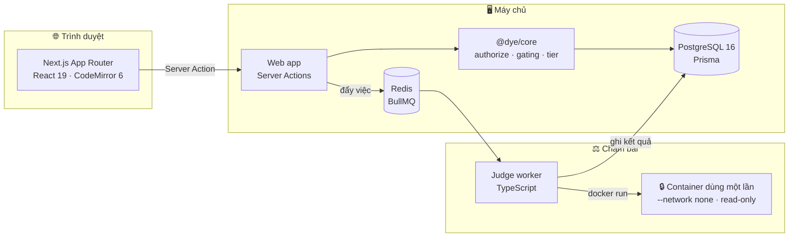

<div align="center">

# 🐍 DYE LMS

**Da Lat Young Beginners — Learning Management System**

_Nền tảng dạy lập trình dành riêng cho học sinh trung học cơ sở._

[](https://nextjs.org)
[](https://react.dev)
[](https://www.typescriptlang.org)
[](https://www.prisma.io)
[](https://www.postgresql.org)
[](https://www.docker.com)
[](#-kiểm-thử--chất-lượng)

**4 khoá học · 94 buổi · 84 bài lập trình chấm tự động · 659 test**

</div>

---

## Dự án này là gì?

DYE LMS là hệ thống quản lý học tập được xây dựng cho một lớp học lập trình có
thật ở Đà Lạt. Toàn bộ nội dung trong cơ sở dữ liệu là **giáo án thật của giáo
viên**, không phải nội dung mẫu: 94 buổi học, từng buổi có mục tiêu, khối lý
thuyết, bài tập và ghi chú sư phạm riêng.

Người học là các em lớp 6 đến lớp 9. Điều đó định hình gần như mọi quyết định kỹ
thuật trong kho mã này — từ cách đặt tên nhánh học, cách một bài bị khoá, cho tới
việc mã của học sinh chạy ở đâu.

### Ba bài toán mà hệ thống này giải

| Vấn đề trong lớp học thật | Cách hệ thống giải quyết |
| --- | --- |
| Mỗi em một tốc độ, nhưng không em nào được thấy mình "kém" | Thang phân nhánh **hoàn toàn tích cực**, mô tả *bài tập* chứ không xếp loại *học sinh* |
| Chấm tay 30 bài Python mỗi buổi là bất khả thi | Bộ chấm tự động chạy trong **hộp cát Docker** đã bị siết chặt |
| Học sinh cấp 2 chán nhanh nếu chỉ có chữ | Ba mạch nội dung: Python → **game Pygame** → **phần cứng Micro:bit** |

---

## 🌱 Triết lý cốt lõi: thang đo tích cực

Đây là ràng buộc quan trọng nhất của dự án, và nó được **cưỡng chế bằng mã**, không
phải bằng lời hứa.

```
Cơ bản  →  Thử thách  →  Nâng cao  →  Mở rộng
```

Bốn nhánh này mô tả **phần việc** mà một em đang làm, và luôn đổi lại được bất cứ
lúc nào. Không có đáy thang nào đọc lên như một lời phán xét:

- **Cơ bản** không có nghĩa là "yếu". Đó là phần nền tảng của giáo án — hoàn thành
  là đã nắm trọn công cụ cốt lõi của buổi học, và được coi là **xong**.
- **Mở rộng** không phải phần thưởng cho "học sinh giỏi". Đó là lối đi thêm cho em
  nào đang muốn đi xa hơn ngày hôm đó.

Hệ quả được cài thẳng vào hệ thống:

1. **Không nhãn thiếu hụt.** Một quy tắc ESLint riêng (`dye/no-deficit-language`)
   chặn các từ như *yếu*, *kém*, *trung bình*, *tụt hậu* xuất hiện trong giao diện.
   Vi phạm làm hỏng build, không phải chỉ cảnh báo.
2. **Bạn cùng lớp không nhìn thấy nhánh của nhau.** Nhánh học chỉ hiện với chính
   em đó và với giáo viên phụ trách.
3. **Giáo viên luôn có quyền quyết định cuối.** Mọi cơ chế khoá bài đều có đường
   can thiệp thủ công, kèm lý do được ghi lại.

---

## ✨ Tính năng chính

### 🐍 Học Python theo lộ trình có kiểm soát

Trình soạn thảo **CodeMirror 6** ngay trong bài học: tô màu cú pháp Python, thụt
lề 4 khoảng trắng, gấp khối, khớp ngoặc. Bản nháp được **tự lưu** theo cơ chế
debounce, có **lịch sử phiên bản** và **so sánh khác biệt** để em quay lại bản cũ
khi lỡ xoá nhầm.

> Trình soạn thảo thoát được bằng bàn phím (`Esc` rồi `Tab`), nên em dùng phím
> hoặc dùng trình đọc màn hình không bị "kẹt" trong ô nhập — WCAG 2.1.2.

### ⚖️ Chấm bài tự động trong hộp cát

Mỗi lượt nộp chạy trong một container Docker dùng một lần, với các giới hạn được
**kiểm chứng bằng test tự động** chứ không chỉ ghi trong tài liệu:

| Ràng buộc | Giá trị | Ngăn được |
| --- | --- | --- |
| `--network none` | không có mạng | Gọi ra Internet, tấn công máy khác |
| `--memory` | 128–256 MB | Cấp phát vô hạn làm treo máy |
| `--cpus` | 0.5 | Vòng lặp vô tận chiếm hết CPU |
| `--pids-limit` | 50 | Fork bomb |
| `--read-only` + `tmpfs noexec` | hệ thống tệp gốc chỉ đọc | Tải xuống rồi chạy mã lạ |
| `--user 1000:1000` | không phải root | Leo thang đặc quyền trong container |

Ba chế độ chấm: **so khớp đầu ra**, **kiểm thử đơn vị**, và **đo hiệu năng** (chạy
với N lớn để phân biệt lời giải O(n) với O(n²)).

### 🎮 Xưởng dự án Pygame

Khu làm việc nhiều tệp cho các dự án game: quản lý tệp và tài nguyên, mốc nộp bài,
luồng giáo viên nhận xét kèm tải về bản `.zip`.

> **Tệp học sinh tải lên không bao giờ được thực thi trên máy chủ.** Nội dung lưu
> theo địa chỉ băm SHA-256 — tên tệp do học sinh đặt không bao giờ trở thành đường
> dẫn trên đĩa — và tệp thực thi bị chặn bằng cách đọc **magic byte**, không tin
> vào phần mở rộng.

### 🤖 Lập trình phần cứng Micro:bit

Nhúng trình soạn khối **MakeCode** ngay trong bài học, chuyển qua lại giữa mạch
Python và mạch Micro:bit liền mạch. Lưu nguyên workspace (XML/JSON) cùng tệp `.hex`
đã biên dịch, và có **luồng chấm tay dành cho bài phần cứng** — vì không hộp cát
nào chạy thay được một mạch điện thật.

### 👩‍🏫 Bảng điều khiển cho giáo viên

Theo dõi tiến độ từng em, cảnh báo sớm, đề xuất đẩy nhanh, mở khoá bài học có ghi
lý do, và bộ giáo trình có kèm ghi chú sư phạm gốc.

---

## 📚 Bốn khoá học

| Khoá | Số buổi | Nội dung |
| --- | --- | --- |
| 🐍 **Python Cơ Bản** | 30 | Biến, kiểu dữ liệu, điều kiện, vòng lặp, hàm, danh sách, tệp |
| 🎮 **Lập Trình Game Python** | 30 | Pygame: vòng lặp game, sprite, va chạm, âm thanh, dự án cuối |
| ⚡ **Python Nâng Cao & Cấu Trúc Dữ Liệu** | 30 | Đệ quy, sắp xếp, tìm kiếm, độ phức tạp, từ điển, tập hợp |
| 🤖 **Lập Trình Micro:bit Cơ Bản** | 4 | Module 1 — khối BASIC: `forever`, `show string`, `show icon`, `pause` |

> Micro:bit hiện mới có Module 1. Các module sau **cố ý chưa được viết**: chúng sẽ
> được bổ sung khi có giáo án gốc, thay vì bịa nội dung cho đủ số buổi.

---

## 🛠 Công nghệ

<table>
<tr><td valign="top" width="50%">

**Ứng dụng**
- Next.js 15 (App Router) + React 19
- TypeScript `strict` + `noUncheckedIndexedAccess`
- Tailwind CSS v4 (`@theme` tokens)
- CodeMirror 6 — trình soạn code
- npm workspaces + Turborepo

</td><td valign="top" width="50%">

**Dữ liệu & hạ tầng**
- PostgreSQL 16 + Prisma 6 (30 model, 13 enum)
- Redis + BullMQ — hàng đợi chấm bài
- Docker — hộp cát thực thi mã
- Playwright — kiểm thử đầu-cuối
- Vitest — unit & integration

</td></tr>
</table>

### 🔐 Xác thực bằng phiên mờ (opaque session)

Auth.js v5 với **phiên lưu trong cơ sở dữ liệu**, không dùng JWT:

- Token phiên được **băm SHA-256** trước khi lưu — lộ cơ sở dữ liệu vẫn không lấy
  được token dùng lại được.
- Cờ `isActive` được **kiểm tra lại ở mỗi request**. Vô hiệu hoá một tài khoản có
  hiệu lực ngay lập tức, chứ không phải chờ token hết hạn.
- Argon2id với bộ tham số OWASP (m=19 MiB, t=2, p=1), khai ở **đúng một chỗ** để
  đường đăng nhập và đường tạo tài khoản không bao giờ lệch nhau.

### 🧭 Phân quyền theo quan hệ, không theo vai trò

Một giáo viên **không** được xem hồ sơ của mọi học sinh chỉ vì họ mang vai trò
`TEACHER`. Mọi truy cập đều phải đi qua một chuỗi quan hệ có thật:

```
Giáo viên → Lớp mình dạy → Ghi danh còn hiệu lực → Học sinh đó
```

Quy tắc này nằm trong một hàm `authorize()` duy nhất ở `@dye/core`, dùng union rời
rạc có kiểm tra vét cạn — thêm một loại tài nguyên mới mà quên khai quyền sẽ **không
biên dịch được**.

---

## 🏗 Kiến trúc



Hàng đợi chỉ mang **id của bài nộp**, không mang mã nguồn: cơ sở dữ liệu là nguồn
sự thật, Redis chỉ là cái chuông báo. Nếu Redis mất kết nối đúng lúc đó, một vòng
quét định kỳ sẽ nhặt lại các bài nộp chưa được xếp hàng — bài của học sinh không
bao giờ nằm im mãi ở trạng thái chờ.

---

## 🚀 Triển khai lên máy chủ

Toàn bộ quy trình đưa hệ thống lên VPS chạy 24/7 — cài Docker, tường lửa, Nginx
reverse proxy, chứng chỉ SSL, sao lưu và phục hồi — nằm ở:

### 📘 **[docs/DEPLOYMENT_GUIDE.md](docs/DEPLOYMENT_GUIDE.md)**

Tóm tắt:

```bash
git clone https://github.com/ThaiTaka/DYE-LMS.git /opt/dye-lms
cd /opt/dye-lms

cp .env.production.example .env.production
chmod 600 .env.production          # rồi điền mật khẩu và AUTH_SECRET

docker compose -f docker-compose.prod.yml --env-file .env.production up -d --build
```

Mọi dịch vụ chạy nền đều mang `restart: always`, nên hệ thống tự sống lại sau khi
máy chủ khởi động lại mà không cần ai đăng nhập vào.

> **Máy chủ thật không có tài khoản demo.** Với `NODE_ENV=production`, bộ seed chỉ
> nạp chương trình học và huy hiệu — **không tạo tài khoản nào**. Tài khoản quản trị
> đầu tiên được tạo riêng bằng `npm run db:admin`, với mật khẩu đọc từ
> `.env.production`. Mật khẩu không bao giờ nằm trong mã nguồn.

### Chạy thử trên máy cá nhân

Xem [docs/SETUP_GUIDE.md](docs/SETUP_GUIDE.md) để chạy từ một máy vừa cài xong.

```bash
cp .env.example .env               # rồi sinh AUTH_SECRET
npm run infra:up                   # postgres + redis
npm run db:migrate && npm run db:seed
npm install && npm run dev
```

---

## 🧪 Kiểm thử & chất lượng

| Bộ test | Số lượng | Chạy thật với |
| --- | --- | --- |
| `@dye/core` | 282 | — |
| `@dye/db` | 41 | PostgreSQL thật |
| `@dye/judge-worker` | 95 | Docker thật |
| `@dye/web` | 241 | PostgreSQL thật |
| **Tổng** | **659** | |
| Playwright E2E | 2 luồng | Bản build production thật |

```bash
npm run typecheck    # TypeScript strict trên toàn workspace
npm run lint         # ESLint, không cho phép cảnh báo
npm run test         # toàn bộ 659 test
npm run e2e          # Playwright, chạy trên bản build production
```

### Test kiểm tra những gì

Đây không phải các test chỉ đọc lại hằng số. Chúng chạy với hạ tầng thật vì những
lỗi đắt giá nhất của dự án này chỉ lộ ra ở đó — một tên hàng đợi chứa dấu `:` mà
BullMQ từ chối, một thư mục làm việc chỉ đọc làm hỏng bài học về tệp, một tệp
`'use server'` xuất ra hằng số khiến Next.js loại bỏ cả module.

Ngoài ra có hai **cổng thường trực** chạy cùng mỗi lần test:

- `bao-mat.test.ts` — kiểm tra mọi server action đều có kiểm tra quyền, đáp án
  không rò ra client, không có `dangerouslySetInnerHTML`, không có bí mật ghi cứng.
- `hieu-nang.test.ts` — đo p95 thật trên dữ liệu thật. Hiện ở mức **44 ms** cho
  bảng tổng quan và **76 ms** cho danh sách lớp, so với ngân sách 300 ms.

---

## 📖 Tài liệu

| Tài liệu | Nội dung |
| --- | --- |
| [`docs/DEPLOYMENT_GUIDE.md`](docs/DEPLOYMENT_GUIDE.md) | **Triển khai VPS: Docker, Nginx, SSL, sao lưu** |
| [`docs/SETUP_GUIDE.md`](docs/SETUP_GUIDE.md) | Chạy dự án từ máy tính mới khởi động |
| [`docs/DATABASE_GUIDE.md`](docs/DATABASE_GUIDE.md) | Xem, sửa và hiểu cơ sở dữ liệu |
| [`docs/01-ARCHITECTURE.md`](docs/01-ARCHITECTURE.md) | Quyết định kiến trúc và lý do |
| [`docs/02-DATABASE.md`](docs/02-DATABASE.md) | Thiết kế schema chi tiết |
| [`docs/03-CURRICULUM-MAP.md`](docs/03-CURRICULUM-MAP.md) | Bản đồ toàn bộ buổi học |
| [`docs/04-ROADMAP.md`](docs/04-ROADMAP.md) | Nhật ký phát triển từng phase |
| [`docs/05-NOI-DUNG-CAN-RA-SOAT.md`](docs/05-NOI-DUNG-CAN-RA-SOAT.md) | Bài tập có lời giải mẫu chưa qua được chính nó |

---

## 🔒 Bảo mật

- **Bộ chấm bài mặc định tắt mạng.** Chỉ bật khi có chính sách sandbox do giáo viên
  uỷ quyền tường minh.
- **Đáp án không bao giờ rời khỏi máy chủ.** `Choice.isCorrect`, `Problem.solutionCode`
  và test case ẩn không nằm trong bất kỳ payload nào gửi về trình duyệt.
- **Markdown render thẳng thành React node**, không đi qua chuỗi HTML. Không có
  `dangerouslySetInnerHTML` trên bất kỳ đường đi nào của nội dung người dùng soạn.
- **Tệp học sinh tải lên không bao giờ được thực thi**, và được phục vụ qua route đã
  kiểm tra quyền với CSP riêng `default-src 'none'; sandbox`.
- **Không có bí mật nào trong kho mã.** Mật khẩu quản trị đọc từ biến môi trường
  trong tệp đã bị `.gitignore` loại trừ.

> Phát hiện lỗ hổng? Vui lòng báo riêng cho người bảo trì thay vì mở issue công khai.

---

## 🗺 Lộ trình

| Phase | Nội dung | Trạng thái |
| --- | --- | --- |
| 0–1 | Phân tích & kiến trúc | ✅ Xong |
| 2 | Database + seed giáo án thật | ✅ Xong |
| 3 | Xác thực & phân quyền quan hệ | ✅ Xong |
| 4 | Engine giáo trình: gating · tier · tiến độ | ✅ Xong |
| 5 | Giao diện học sinh | ✅ Xong |
| 6 | Giao diện giáo viên & phân tích | ✅ Xong |
| 7 | Trình soạn code (CodeMirror 6) | ✅ Xong |
| 8 | Judge engine (hộp cát Docker) | ✅ Xong |
| 9 | Xưởng dự án Pygame | ✅ Xong |
| 11 | Tích hợp Micro:bit (MakeCode) | ✅ Xong |
| 12 | Rà soát bảo mật · E2E · triển khai | ✅ Xong |
| 10 | Phủ kín test theo tiêu chí nghiệm thu | ⬜ Kế tiếp |

---

<div align="center">

**DYE LMS** · Học lập trình Python cùng nhau 🐍

_Đà Lạt · 2026_

</div>
